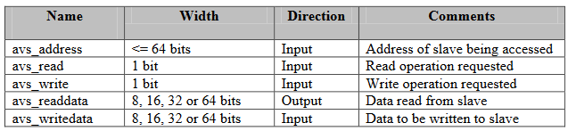

+++
draft = true
title = "Avalon Streaming Interface"
description = ""
type = ["posts","post"]
tags = [
    "fpga",
    "development",
    "avalon",
]
date = "2023-07-08"
categories = [
    "FPGA",
]
series = ["Field Programmable Gate Arrays"]
[ author ]
  name = "Hubert Choo"
+++

## What is the Altera Avalon MM Interface?
From the [Altera Interface Specification](https://www.cs.columbia.edu/~sedwards/classes/2008/4840/mnl_avalon_spec.pdf):

"The Avalon Memory-Mapped (Avalon-MM) interface specification is designed to accommodate peripheral development for the system-on-a-programmable-chip (SOPC) environment."

In other words, an Avalon MM interface is control the flow of data between an FPGA hardware module designed in HDL and a processor, both soft-core or hard-core.

Altera's built-in QSys compatible IP components have custom Avalon MM slave designed embedded into the component. However, when we create our own IP and would like to include it in a SoC design or to use with NIOS, we have to create our own Avalon MM slave design and incorporate it into the SoC using QSys.

The Avalon MM employs a master-slave protocol with the CPU acting as a master, and the
FPGA peripherals acting as slave.

Common Avalon MM bus signals are:

[Very good guide with a tutorial](https://people.ece.cornell.edu/land/courses/ece5760/DE1_SOC/Making_Qsys_Components_15_0.pdf)