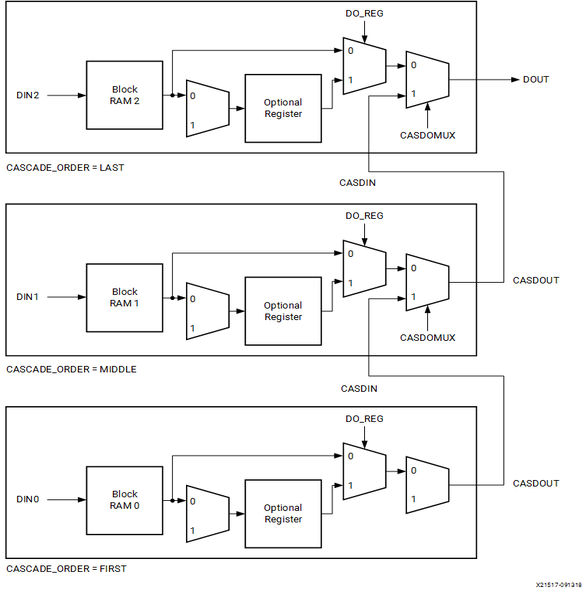

+++
draft = false
title = "Block RAMs"
description = ""
type = ["posts","post"]
tags = [
    "FPGA",
    "development",
]
date = "2023-10-01"
categories = [
    "Digital Electronics",
]
series = ["FPGA"]
[ author ]
  name = "Hubert Choo"
+++

## Block RAM

- Can be instantiated or initialised (using GUI or in HDL).

### Size Details
- Block RAM comes in fixed sizes. If your block RAM has size of 16Kb and you only have to use 4Kb, you will still use up the entire block RAM primitive. 
- However, block RAM can also be quite flexible. For example, with a 16Kb block RAM, we can store data that is 1 bit wide and 16,384 bits deep, or 8 x 2048, among other possibilities. 
- We can also create memories that are larger than a single black of RAM, by cascading the block RAMs and making them look like one large memory. 

### Cascading Block RAM
To create a larger memory, you can connect multiple BRAM blocks in series or parallel. This is known as cascading.

#### Series Connection
- In a series connection, the output of one BRAM block is connected to the multiplexer of the next, forming a chain. This increases the overall address space, allowing you to create a larger memory structure. In a sense, this is just using many different Block RAMs, but having a multiplexer to select which Block RAM's data to output.

- However, this increases the latency of the Block RAM. In order to run the block RAM at higher frequencies, we can make use of additional pipeline stages in each cascaded Block RAM.

#### Parallel Connection
- In a parallel connection, multiple BRAM blocks are connected in parallel, effectively increasing the data width or the number of read/write ports. This means that if we have a 16 bits x 16,384 memory for example, we can split this up into 16 parallel block RAMs that are each 1 bit x 16,384 large. We then concatenate in parallel the output of these 16 block RAMs.

In our take home assignment, for each histogram module we had $2^{12}=4096$ possible words (memory locations), with each word having a width of 48 bits (input and output width). This means a total of $4096 * 48 = 196,608$ bits of memory needed.

The synthesis outcome was the use of $196,608 / 128 = 1536$ 128x1D Dual Port RAM that are each 128-bit deep and 1-bit wide. This means that it is likely that a combination of series and parallel connections are used. 
- Given that each 128x1D BRAM is 1 bit wide, there should be 48 connections in parallel to achieve a 48 bit wide output. 
- The value of each bit in the parallel output is then given by a series connection of BRAM blocks. Each such output bit is driven by $4096/128 = 32$ BRAMs in series connection.

### Rules for Instantiation of Block RAMs
1. Any RAM access should be contained in its own always block
2. RAM can only be initialized once
3. Don’t put a RAM access in a cascaded if
4. Don’t put a RAM in a port list
5. Don’t put a RAM in a block with other things

https://zipcpu.com/tutorial/lsn-08-memory.pdf