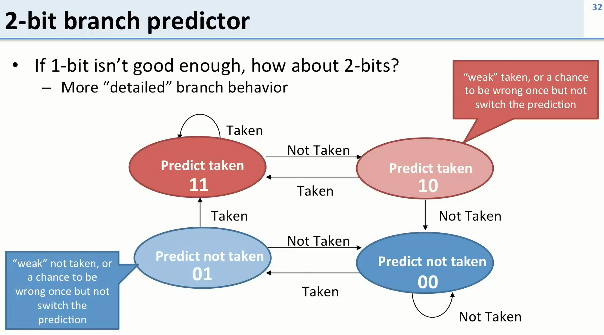

+++
title = "Five-Stage Pipelined MIPS Series: 9. Hazards"
description = ""
type = ["posts","post"]
tags = [
    "fpga",
    "digital electronics",
]
date = "2023-07-18"
categories = [
    "Digital Electronics",
]
series = ["Digital Electronics"]
[ author ]
  name = "Hubert Choo"
+++

## Pipelining and Hazards
We have seen that we can use pipelining to perform multiple instructions in parallel, with each stage isolated by a register. Ideally, for $n$ stages, there will be an $n$ times speedup.

However, the instructions can interfere with each other and cause hazards. There are 3 types of hazards:
- Different instructions have to access the same resources (structural hazard)
- Instructions need results that are not yet ready from other instructions (data hazard)
- Instructions need to execute differently depending on results of other instructions, but the results are not yet ready (control hazard)

### Structural Hazard with a Register File
- For example, when two instructions want to read and write to the Register File at the same cycle, but we only have one resource (one register file).

There are several ways for us to fix it:
1. Delay the reading instruction (but it is bad for our performance due to the delay)
2. Never write conflicting instructions (bad for our performance as it limits what instructions we could use)
3. One 'cheat' way is that we can use a double-pumped register file. The write is performed in the 1st half of the clock cycle, and the read is performed in the 2nd half of the clock cycle. (Write must come before read so that we can use the data from previous operations for our current operations!)

### Control Hazard
Some of the instructions directly after the branch instruction have already had their computation started, before we can compute the branch decision. This is because the branch decision is only known at the 4th stage of the pipeline.

There are several ways for us to fix it:
1. Stall the pipeline until the branch decision is made. In this case, stalling means not running any new instructions. However, the pipeline would have to be stalled for 3 cycles at every branch.
2. Predict whether the branch will be taken using a branch predictor and begin executing instructions based on the prediction. Once the branch decision is available, the processor can throw out the instructions if the prediction was wrong.

#### Static Branch Predictors
A static branch predictor never changes in its output and does not use any history of the program to inform its prediction. 

Some options for static branch predictors are:
1. Branch always not taken (what we used in our design)
2. Branch always taken
3. A branch that leads backwards is always taken : this is based on the argument that a loop is likely to happen many times, and that a loop is given by a branch that leads backwards in instruction address.
4. A branch that leads forward is always not taken

#### Dynamic Branch Predictors
A dynamic branch predictor attempts to learn what a branch would do in the future.

Some options for dynamic branch predictors are: 
1. A 1-bit branch predictor. For each branch instruction in the program, one bit is used to save whether the branch was taken (saved as 1) or not taken (saved as 0).
2. A 2-bit branch predictor is a state machine that allows for there to be two 'weakly not taken' and 'weakly taken' states. These give the branch predictor one chance to be wrong in its prediction, but still do the same prediction the next time around. Only when it is wrong twice does the branch predictor change its prediction to the opposite.

### Data Hazard
An instruction that starts later might need to read out the value of a register for its operation, before a previous instruction has successfully been completed and its result written to that same register. This means that the later instruction will be using the wrong data.

We can fix this by:
1. Delay the reading instruction. In this case, the instruction is still started, but once it reaches the stage where it needs to read a register, the reading of the register is delayed until the correct data is available in the Register File. To do this, we need hardware that looks at the intruction bits in the pipeline registers and detects when instructions need to read data that is written to in an earlier instruction.

